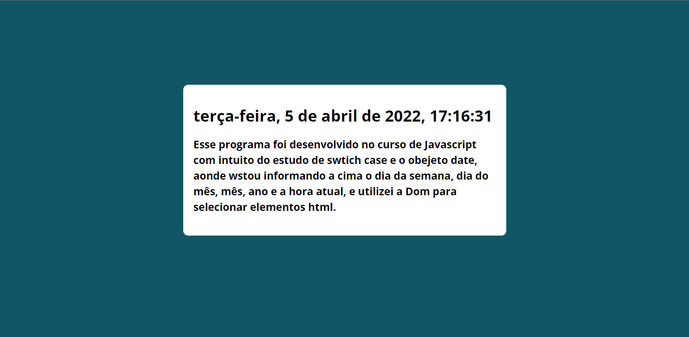

<h1>Exercício utilizando Javascript</h1>

<h2>Sobre</h2>

Esse exercício foi proposto para aplicar meus conhecimentos em javascript, basicamete
usando o objeto Date nativo do javascript exibi os dados dia da semana, dia so mês, mês, ano e as horas. Fiz de duas formas o mesmo programa o primeiro de uma maneira mais longa usando o swicth case para fazer as validações e a outra usando arrays que deixou meu código mais limpo.

<h2>Tecnologias</h2>
<ul>
<li>Html</li>
<li>Css</li>
<li>JavaScript</li>
</ul>